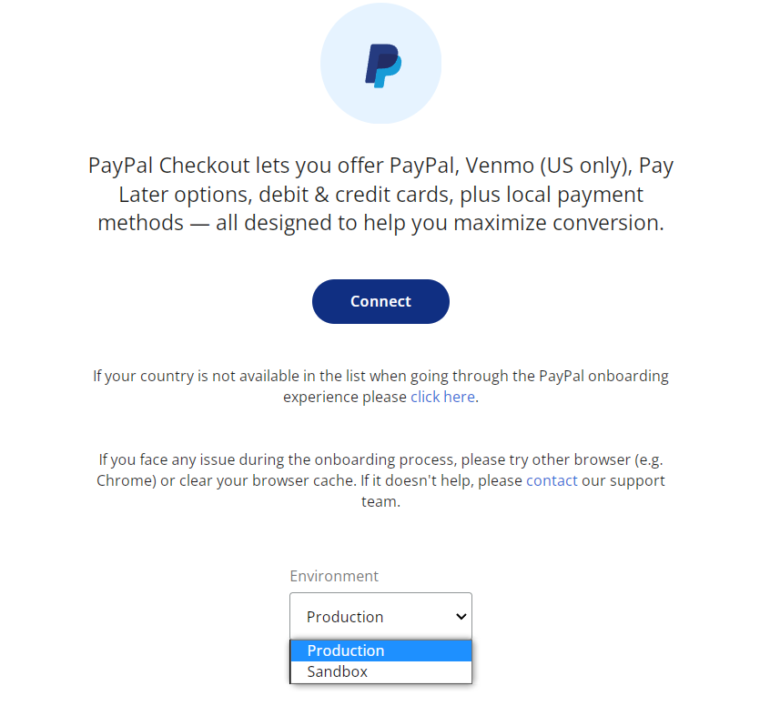
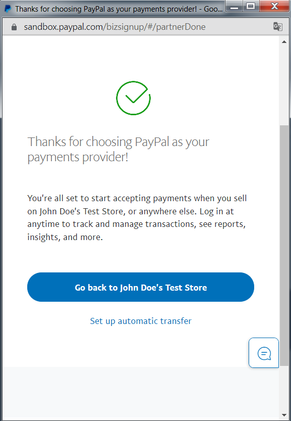
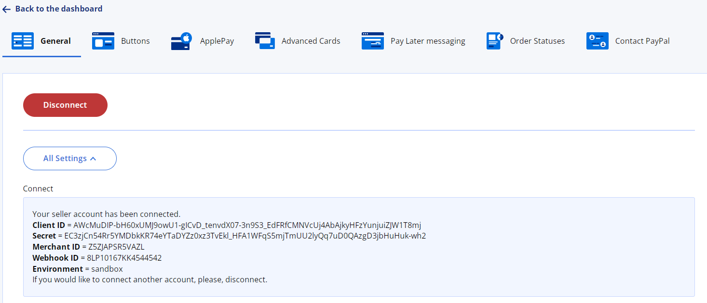
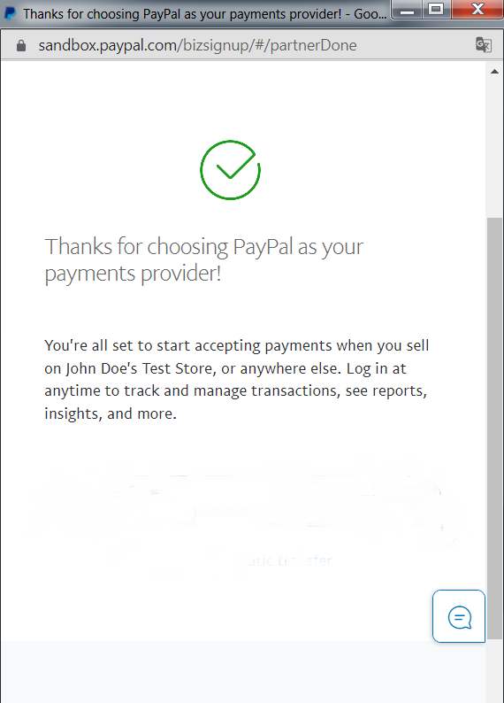
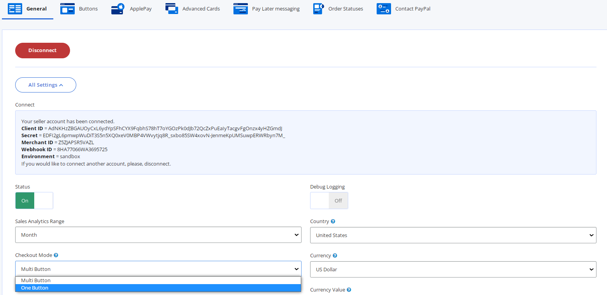
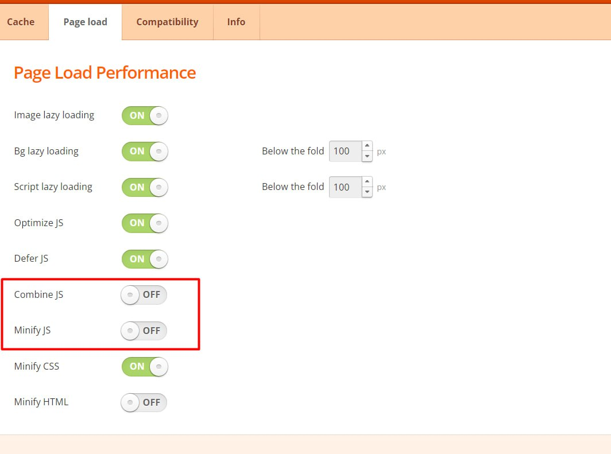
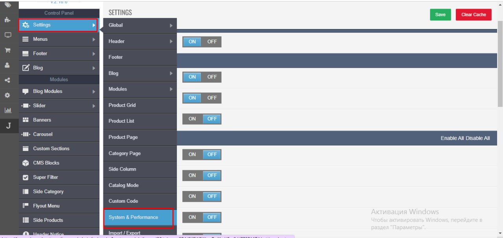
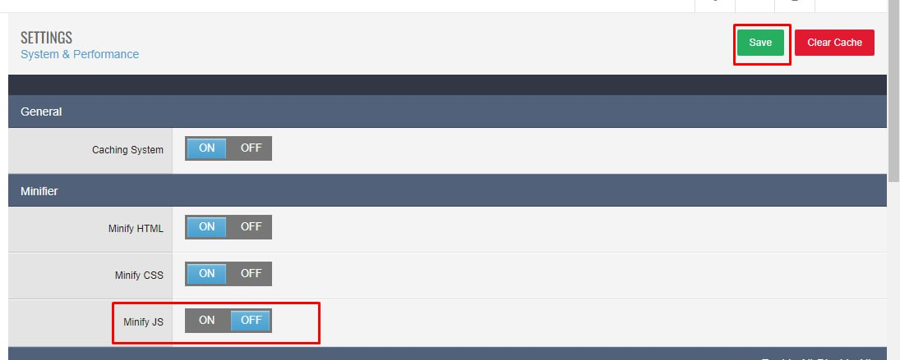

### 1. How to connect your account?
> We recommend using the Chrome browser for the onboarding process.

- Ensure that your Environment is set to Production mode.
- Click the Connect button, input your login information, and follow all the steps that PayPal will require from you.
  


- At the final step click on the "Go back to..." button and you will be redirected to your site, where you will be provided with all the necessary details and can start working with the payment.
  


If, for some reason, any parameter was left blank, you should repeat the entire authorization process again.



-----

### 2. There is no "Go back to..." button on the final step.



This is because you are using Apache and the .htaccess file includes the following lines:

``` <IfModule> ... </IfModule> ```

We recommend that you delete these lines from the file and then go through the authorization process again. Once you have successfully authorized, you can add the lines back in.

-----

### 3. After I returned to my site, instead of successfully authorizing, I encountered an error.
``` Authentication failed due to invalid authentication credentials or a missing Authorization header. ``` 


Please try to authorize with a different browser, such as Google Chrome.

-----

### 4. I am using the Journal theme and the PayPal buttons and the Card Payment form do not work correctly.
Please open All Settings on the General tab and set Checkout Mode to One Button.



This mode is compatible with all modern payment checkout modules. Initially, only one button will be visible, similar to other payment options. Upon clicking on it, a pop-up will appear displaying all the other buttons and a card payment form.

-----

### 5. After updating the payment, PayPal stopped working on the Checkout, Product, and Cart pages.
Please reinstall the payment method. Click Disconnect on the General tab, then exit and click Uninstall. Then install it again.

-----

### 6. I use a custom theme and PayPal doesn't work on the Checkout, Product, and Cart pages.
There are templates like Journal or BurnEngine that prevent the display of styles and scripts. This usually occurs when styles and scripts are minified or cached.

Please try disabling minification, bundling, and caching and check if PayPal is working.

#### BurnEngine



#### Journal 3





